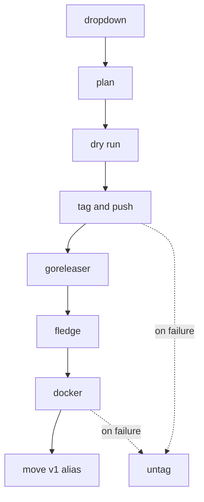

# Quill

Cut a release from a dropdown.

Pick **Release** or **Release Candidate**, pick **patch**, **minor** or **major**, and press the button.
Quill works out the version from your tag list, refuses to release off the wrong branch, proves the thing builds before it commits to a number, tags it, publishes it, and takes the tag back if any of that fails.

```yaml
- uses: TheOutdoorProgrammer/quill@v1
  with:
    bump: ${{ inputs.bump }}
    scope: ${{ inputs.scope }}
    publish: goreleaser
```

It publishes through [GoReleaser](https://goreleaser.com), through [Fledge](https://github.com/TheOutdoorProgrammer/fledge) for iOS builds, through Docker to any registry, through any combination of the three, or through none of them.

## What it actually does



Everything above `tag and push` is side-effect free.
The branch guard, the version arithmetic, and the full cross-build all happen before a tag exists, because a tag cut for a release that then fails to build burns that version number forever.

## Use it

The dropdowns have to live in your repository, not here.
GitHub requires `workflow_dispatch` inputs to be declared in the workflow file that is dispatched, so there is no way to ship them from an action.
That block is the only boilerplate quill cannot take off your hands.

```yaml
name: release

on:
  workflow_dispatch:
    inputs:
      scope:
        description: What to cut
        type: choice
        default: Release
        options: [Release, Release Candidate]
      bump:
        description: Which part of the version to bump
        type: choice
        default: patch
        options: [patch, minor, major]

permissions:
  contents: read

jobs:
  release:
    runs-on: ubuntu-latest
    permissions:
      contents: write
    steps:
      - uses: actions/checkout@v5
        with:
          fetch-depth: 0

      - uses: TheOutdoorProgrammer/quill@v1
        with:
          bump: ${{ inputs.bump }}
          scope: ${{ inputs.scope }}
          publish: goreleaser
```

`fetch-depth: 0` is not optional.
The default checkout is depth 1 and carries no tag history, so the next version would restart at the beginning and clobber your real version line.
Quill detects a shallow checkout and refuses rather than guessing.

### Pull requests

Point the same action at a pull request with `dry-run` and you get the full cross-build with nothing published and no tag cut.
A break that only shows up on `windows/arm64` is invisible to `go test` on whichever runner you happen to use, so it is worth doing on every change.

```yaml
on: pull_request

jobs:
  snapshot:
    runs-on: ubuntu-latest
    steps:
      - uses: actions/checkout@v5
        with:
          fetch-depth: 0
      - uses: TheOutdoorProgrammer/quill@v1
        with:
          dry-run: "true"
          publish: goreleaser
```

`dry-run` also drops the branch guard, because a pull request never runs on your release branch.

## Publishers

`publish` is a set, not a choice.
List several and they all run against one version and one tag, which is what a repository carrying a binary and a container image wants.

| `publish` | What happens |
| --- | --- |
| `none` | Tag, and a GitHub release with generated notes |
| `goreleaser` | GoReleaser builds, publishes, and writes its own release |
| `fledge` | Tag, a GitHub release, and the archive goes to a Fledge server |
| `docker` | Tag, a GitHub release, and a multi-platform image pushed to a registry |
| `goreleaser, docker` | Both, on the same tag |

**The order is fixed: GoReleaser, then Fledge, then Docker.**
Listing them in another order does not run them in another order, so the run summary reports the sequence that actually happened.
GoReleaser goes first because it produces the release the others might reference, Docker last because an image is the artefact most likely to consume one.
[`adr/0005`](adr/0005-publishers-run-in-a-fixed-order.md) has the reasoning, including why a caller-chosen order was built and then removed.

A typo is refused rather than silently publishing nothing.

### GoReleaser

Nothing to configure beyond your existing `.goreleaser.yaml`.
Quill runs `release --snapshot --clean --skip=publish` before tagging and `release --clean` after, and pins `GORELEASER_CURRENT_TAG`, because `git describe` picks the wrong tag when a release and its candidate sit on the same commit.

Credentials reach it through `env`:

```yaml
- uses: TheOutdoorProgrammer/quill@v1
  with:
    publish: goreleaser
    env: |
      FURY_TOKEN=${{ secrets.FURY_TOKEN }}
```

Values are written straight into the job environment.
They never appear in the log, in the run summary, or in the process list.

### Homebrew taps

Publishing a cask writes to a second repository, which the job's own token cannot reach.
Give quill a GitHub App and it mints a token scoped to that one repository, good for an hour, instead of a personal access token that lives in settings until somebody rotates it:

```yaml
- uses: TheOutdoorProgrammer/quill@v1
  with:
    publish: goreleaser
    tap-app-id: ${{ secrets.TAP_APP_ID }}
    tap-private-key: ${{ secrets.TAP_APP_PRIVATE_KEY }}
```

That exports `HOMEBREW_TAP_GITHUB_TOKEN`, which is the variable a `homebrew_casks` block already expects.
Set `tap-repository` if your tap is not called `homebrew-tap`.

### Docker

Quill does the whole thing: Buildx, the registry login, the tags, and a multi-platform build and push.

```yaml
- uses: TheOutdoorProgrammer/quill@v1
  with:
    publish: docker
```

That defaults to `ghcr.io/<this repository>`, lowercased, built for `linux/amd64` and `linux/arm64`, authenticated with the job's own token, cached in the Actions cache.
`VERSION` and `COMMIT` are passed as build arguments, so a Dockerfile can stamp them without the workflow knowing the version.

Tags come out as `1.2.3`, `1.2`, `1`, and `latest`:

| Cutting | Tags pushed |
| --- | --- |
| `v1.2.3` | `1.2.3`, `1.2`, `1`, `latest` |
| `v1.3.0-rc.1` | `1.3.0-rc.1` |

**A release candidate never takes `latest`**, and never takes the major or minor tags either.
That matters more than it looks: an unguarded `latest` means `docker pull` with no tag hands people a candidate.

The version is passed to the tagger explicitly rather than read off the ref, because quill has not created the tag yet when the image is built.
For the same reason, do not reach for `github.ref_name` in a build argument: the workflow runs on your default branch, so it is not the version.

Override anything you need to:

```yaml
- uses: TheOutdoorProgrammer/quill@v1
  with:
    publish: docker
    docker-images: docker.io/myorg/myapp
    docker-registry: docker.io
    docker-username: ${{ secrets.DOCKERHUB_USERNAME }}
    docker-password: ${{ secrets.DOCKERHUB_TOKEN }}
    docker-platforms: linux/amd64
    docker-file: build/Dockerfile
    docker-build-args: |
      GO_VERSION=1.26
```

Before tagging, quill builds the image without pushing, so a broken Dockerfile does not burn a version number.
That is close to free rather than double the work, because the check populates the cache the pushing build then reads.
Turn it off with `docker-dry-run: "false"`.

Pushing to `ghcr.io` needs `packages: write` on the job, alongside `contents: write`.

### Fledge

Every Fledge input defaults to empty on purpose, because Fledge reads the `fledge.yaml` beside your app.
Configuration has one home rather than two:

```yaml
- uses: TheOutdoorProgrammer/quill@v1
  with:
    publish: fledge
    fledge-token: ${{ secrets.FLEDGE_TOKEN }}
```

Drop `fledge-token` entirely and add `id-token: write` to the job to authenticate with a workload identity token instead, so there is no stored secret at all.

One thing worth knowing: quill checks the archive exists **before** it cuts a tag, but only when you pass `fledge-ipa`.
When the path comes from `fledge.yaml`, quill never sees it, and a missing archive fails after the tag is cut instead of before.
Pass `fledge-ipa` as well if you want that guard, or let the untag-on-failure step clean up.

## How the version is worked out

| Latest tag | scope | bump | Next |
| --- | --- | --- | --- |
| none | Release | `patch` | `v0.0.1` |
| none | Release | `minor` | `v0.1.0` |
| none | Release | `major` | `v1.0.0` |
| `v1.2.0` | Release | `patch` | `v1.2.1` |
| `v1.2.0` | Release | `minor` | `v1.3.0` |
| `v1.2.0` | Release | `major` | `v2.0.0` |
| `v1.2.0` | Release Candidate | `minor` | `v1.3.0-rc.1` |
| `v1.3.0-rc.1` | Release Candidate | any | `v1.3.0-rc.2` |
| `v1.3.0-rc.1` | Release | any | `v1.3.0` |

Two rules are worth stating outright, because they are the ones that surprise people:

**Promoting a candidate ignores the bump.**
`v1.3.0-rc.1` *is* `v1.3.0` in rehearsal.
Bumping again would ship a release the candidate never tested and strand `v1.3.0` at a version that never happens.

**A candidate continues the line it is on.**
Once `v1.3.0-rc.1` exists the next candidate is `rc.2` for the same version, not a candidate for a further one.

With no tags at all the bump applies to an implicit `v0.0.0`, so a project that means to open at `1.0.0` says `major` and gets it.

Tags quill does not recognise are dropped rather than guessed at, because one misread tag picks the wrong version for every release after it.
That includes foreign prerelease shapes like `v1.3.0-beta.1` and the moving major aliases quill creates itself.

## Pinning

Quill moves a `vN` tag to each release, the way `actions/checkout@v4` does, so `@v1` keeps working and keeps getting fixes:

```yaml
- uses: TheOutdoorProgrammer/quill@v1        # tracks every v1.x.y
- uses: TheOutdoorProgrammer/quill@v1.4.2    # frozen
```

The alias never moves for a release candidate, and it moves last, only once everything published.
A failed release leaves it pointing where it was.

Set `major-alias: "false"` if you would rather it did not.

## What it refuses to do

| It refuses | Because |
| --- | --- |
| Release off a non-default branch | The tag points at history that is not on main, which cannot be unpicked afterwards |
| Release from a shallow checkout | There are no tags to count from, so the version would silently restart |
| Publish an archive that does not exist, or two that match | A publisher would fail after the tag was cut, or pick one at random |
| An unknown `bump`, `scope` or `publish` value | A typo that fell back to a default would ship the wrong version with no warning |

And when a release fails after tagging, quill deletes the tag locally and remotely.
A tag left behind burns that version number: the next attempt computes the one after it, and the failed tag stays forever as a release that never happened.

## Inputs

| Input | Default | |
| --- | --- | --- |
| `bump` | `patch` | `patch`, `minor` or `major` |
| `scope` | `Release` | `Release` or `Release Candidate` |
| `publish` | `none` | Any of `goreleaser`, `fledge` and `docker`, comma or newline separated, or `none`. Order is fixed |
| `dry-run` | `false` | Do everything side-effect free and stop before tagging |
| `release-branch` | `refs/heads/main` | The only ref a release may come from. Empty allows any |
| `major-alias` | `true` | Move the `vN` tag. Never moves for a candidate |
| `working-directory` | `.` | The checkout to release from |
| `env` | | `KEY=value` lines exported before publishing |
| `github-token` | `github.token` | Used to tag and to create the release |
| `github-release` | `auto` | `auto` leaves it to GoReleaser when GoReleaser is publishing |
| `goreleaser-version` | `~> v2` | |
| `goreleaser-args` | `release --clean` | The dry run is always a snapshot |
| `docker-images` | `ghcr.io/<repo>` | Lowercased, because a registry path cannot carry the owner's capitalisation |
| `docker-registry` | `ghcr.io` | Logged in to, and used to build the default image name |
| `docker-login` | `true` | Turn off if the job already logged in |
| `docker-username` | `github.actor` | |
| `docker-password` | `github.token` | Enough for `ghcr.io` |
| `docker-context` | `.` | |
| `docker-file` | | Empty means the default for the context |
| `docker-platforms` | `linux/amd64,linux/arm64` | |
| `docker-build-args` | | Extra args. `VERSION` and `COMMIT` are always passed first |
| `docker-tags` | | `metadata-action` spec. Empty means semver plus a guarded `latest` |
| `docker-cache` | `true` | Use the Actions build cache |
| `docker-dry-run` | `true` | Build without pushing before tagging |
| `fledge-server` | | Empty defers to `fledge.yaml` |
| `fledge-token` | | Empty uses a workload identity token |
| `fledge-audience` | | Empty defaults to the server URL |
| `fledge-ipa` | | Also enables the pre-tag archive check |
| `fledge-notes` | | Empty defers to `fledge.yaml`, then the commit subject |
| `fledge-fail-on-development-signing` | | Empty defers to `fledge.yaml` |
| `fledge-secure` | `false` | Keep the server URL out of the log and summary |
| `tap-app-id` | | With `tap-private-key`, mints `HOMEBREW_TAP_GITHUB_TOKEN` |
| `tap-private-key` | | |
| `tap-repository` | `homebrew-tap` | What the minted token may reach |

## Outputs

| Output | |
| --- | --- |
| `version` | The version cut, for example `v1.2.0` |
| `previous` | The tag this follows, empty for a first release |
| `range` | The commit range between the two |
| `prerelease` | Whether this is a candidate |
| `released` | Whether a tag was actually cut. `false` for a dry run |
| `publish-order` | The publishers that ran, in the order they ran |
| `image-tags` | The image tags that were pushed |
| `image-digest` | Digest of the pushed image |
| `page-url` | Fledge install page to open on a device |
| `install-url` | Fledge `itms-services` manifest URL |

## How it is built

The thinking is a Go binary, committed to `dist/` for `linux` and `darwin` on `amd64` and `arm64`.
Nothing is downloaded and no toolchain is installed, so the action runs identically on a Linux release runner and a macOS iOS runner.

A committed binary that no longer matches the source beside it is a silent lie, so CI rebuilds `dist/` and diffs it on every change.
That only works if builds are reproducible, which is why `make dist` pins the Go toolchain exactly, strips VCS stamping, and passes `-trimpath`.

```console
make test          # go test -race
make lint          # gofmt, vet, golangci-lint
make dist          # rebuild the committed binaries
make verify-dist   # rebuild and fail if anything changed
```

Quill releases itself with itself.
Its own `release.yml` uses `uses: ./` rather than a pinned tag, so a change that breaks the release path fails in quill's own release before anyone else can pin it.

The decisions worth not re-litigating are in [`adr/`](adr/).
